# Authentication Configuration

This document outlines the Supabase Auth setup and user statistics.

## 🔍 How to Extract Auth Information

```sql
-- Basic user statistics
SELECT
    count(*) as total_users,
    count(*) FILTER (WHERE email_confirmed_at IS NOT NULL) as confirmed_users,
    count(*) FILTER (WHERE created_at > NOW() - INTERVAL '30 days') as recent_signups
FROM
    auth.users;

-- Auth providers enabled (check in Supabase dashboard > Authentication > Providers)
```

---

## 👥 User Statistics

### Current User Base ✅

| Metric              | Count | Status                       |
| ------------------- | ----- | ---------------------------- |
| **Total Users**     | 9     | Good test data               |
| **Confirmed Users** | 8     | 89% confirmation rate        |
| **Recent Signups**  | 0     | No new users in last 30 days |

**Analysis**: System has good test data with high confirmation rate.

---

## 🔐 Authentication Features

### Implemented Features ✅

1. **Email/Password Authentication**

   - Standard Supabase auth with email confirmation
   - Profile creation triggered automatically

2. **Google OAuth Integration**

   - Configured via `@react-oauth/google` package
   - Seamless social login experience

3. **Automatic User Setup**

   - Profile creation via `handle_new_user()` trigger
   - Role assignment via `assign_role_on_signup()` trigger
   - Default role: 'job_seeker'

4. **Role-Based Access Control**
   - Roles: admin, employee, job_seeker
   - Automatic promotion: job_seeker → employee on hire
   - Comprehensive RLS policies

---

## 🔧 Auth Flow

### New User Registration


### Job Application to Employee Flow

```mermaid
graph TD
    A[User Applies for Job] --> B[Admin Reviews Application]
    B --> C[Admin Accepts Application]
    C --> D[promote_to_employee Trigger]
    D --> E[Role Changed: job_seeker → employee]
    E --> F[User Can Access Employee Features]
```



---

## 🛡️ Security Configuration

### Password Requirements

- **Minimum Length**: Default Supabase settings
- **Email Confirmation**: ✅ Enabled (89% confirm rate)
- **Password Reset**: ✅ Available via Supabase

### Session Management

- **JWT Tokens**: Handled by Supabase Auth
- **Session Persistence**: Managed by `@supabase/auth-helpers-react`
- **Auto Refresh**: Built into Supabase client

### OAuth Providers

- **Google**: ✅ Enabled via `@react-oauth/google`
- **Additional Providers**: Can be added via Supabase dashboard

---

## 🎯 Auth Security Assessment

### ✅ **Strengths**

1. **Multi-Provider Support** - Email + Google OAuth
2. **Automatic Setup** - Users get profiles and roles immediately
3. **Role-Based Security** - Proper access control throughout system
4. **High Confirmation Rate** - Users are completing email verification

### 🔧 **Recommendations**

1. **Password Policy** - Consider stronger password requirements
2. **MFA Support** - Add two-factor authentication for admin users
3. **Session Monitoring** - Add logging for security events
4. **Account Lockout** - Protection against brute force attacks

---

## 📊 Production Readiness

**Authentication Layer**: ⭐⭐⭐⭐ **Very Good**

- Solid multi-provider setup
- Automatic user provisioning
- Role-based access control
- Good user adoption (89% confirmation)

**Missing for Production**:

- MFA for admin accounts
- Stronger password policies
- Security event logging
- Account lockout protection

---

_📝 Authentication is well-configured with room for security enhancements_
